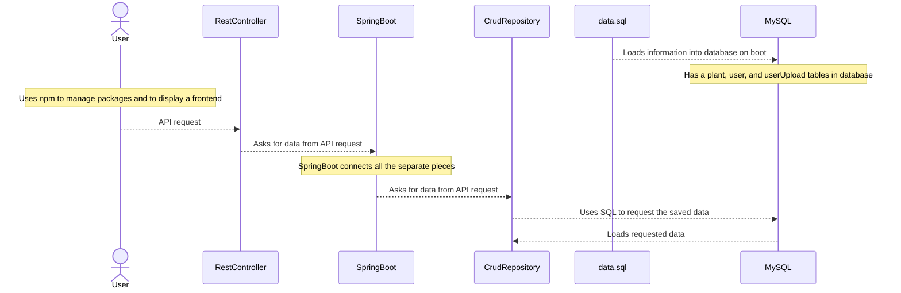

# Useful and Invasive Plants in Ohio

## Instructions for Application Setup

- Using Chocolaty within a PowerShell type `choco install mysql`
- Type `mysql -u root -e "CREATE DATABASE uip"` into gitBash
- Boot UIP for <http://localhost:8080/>
- `cd UsefulandInvasivePlants` and type `npm start` into Terminal to boot slides at <http://localhost:3000/>

## Functionality

Useful and Invasive Plants is a plant identification tool to assist in identifying your local ecosystem.

- Register an account and log in to save collections of plants in your local area
- Search for plants with multiple images, for leaf and flower/fruit identification
- Every invasive plant listed by the Ohio Department of Agriculture is cataloged
- Native plants from multiple lists on <https://www.ohionativeplantmonth.org/native-plant-list> are cataloged
- Ability for registered users to upload new plants to be added to the database pending review by curators
- Plant ID's start at -1 and descend

## Endpoints

### Plant Endpoints

Request body example -- `-d {"commonName":"test","scientificName":"scientific test","description":"concise description test","isInvasive":false,"isNative":true,"color":"Red","imageFruitURL":"test/url.jpg","imageLeafURL":"test/url.jpg","imageFruitSource":"test source1","imageLeafSource":"test source2","plantID":-1,"wikiLink":"https://en.wikipedia.org"}`

- GET ALL PLANTS -- `curl -s http://localhost:8080/api/plants -H 'Content-Type: application/json`
- GET SINGLE PLANT -- `curl -X GET http://localhost:8080/api/plants/{plant_id} -H 'Content-Type: application/json`

### User Endpoints

## Catalog Formatting

``` sql
INSERT INTO
    plant (
        common_Name,
        scientific_Name,
        description,
        is_Invasive,
        is_Native,
        color,
        image_FruitURL,
        image_LeafURL,
        image_Fruit_Source,
        image_Leaf_Source,
        wiki_Link,
        plantID
    )
VALUES
    (
        'Red Raspberry',
        'Rubus idaeus',
        'Rubus idaeus, commonly known as raspberries, are perennial plants with biennial stems that grow from a perennial root system. These plants produce edible red aggregate fruits consisting of numerous drupelets around a central core, with distinct growth patterns in their first and second years.',
        false,
        true,
        'Red',
        'fruitImages/Raspberries(F).jpg',
        'leafImages/Raspberries(L).jpg',
        'By Ivar Leidus - Own work, CC BY-SA 4.0, https://commons.wikimedia.org/w/index.php?curid=96641162',
        'By Tomwsulcer - Own work, CC0, https://commons.wikimedia.org/w/index.php?curid=19087683',
        'https://en.wikipedia.org/wiki/Rubus_idaeus',
        -1
    );
```

## UIP Data-flow


