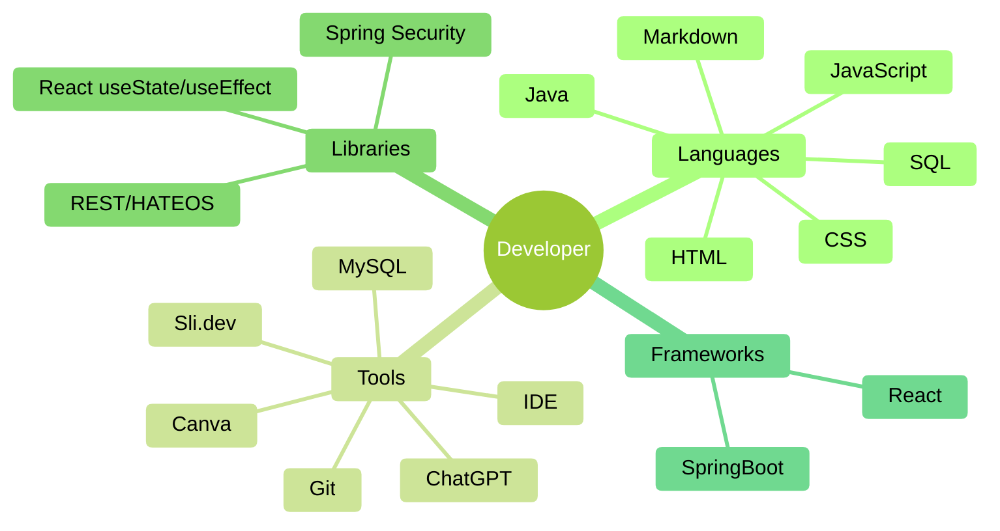
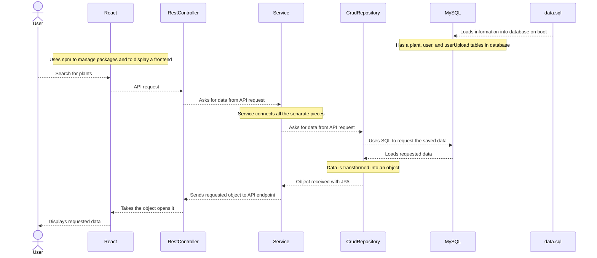

# Useful and Invasive Plants in Ohio

## Created By

- Abdikarim Farah 
- Dawson Black 
- Robert Johnson 
- Siman Farah 

---

## Technologies Used Mindmap

---

## Flow of Data

---

## Languages

### Java

### JavaScript

### HTML

### CSS

### SQL

### Markdown

---

## Tools

### IDE

### MySQL

### Git

### ChatGPT

### Canva

### Sli.dev

---

## Libraries

### Spring Security

### REST/HATEOS

### React useEffect/useState

---

## Frameworks

### SpringBoot

### React

---
